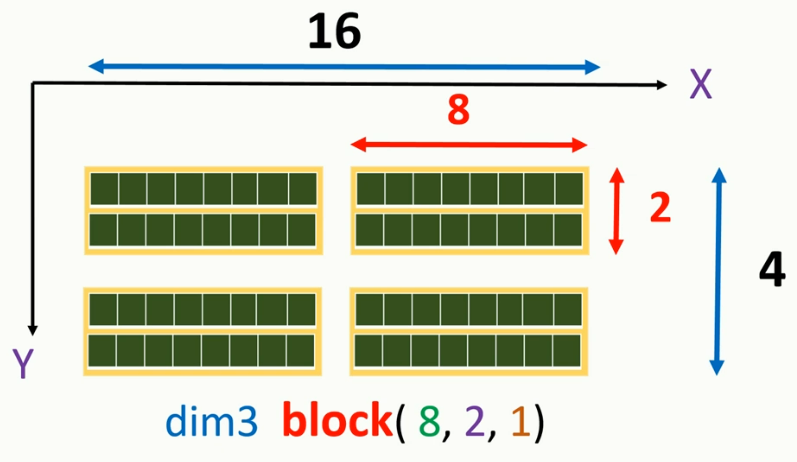
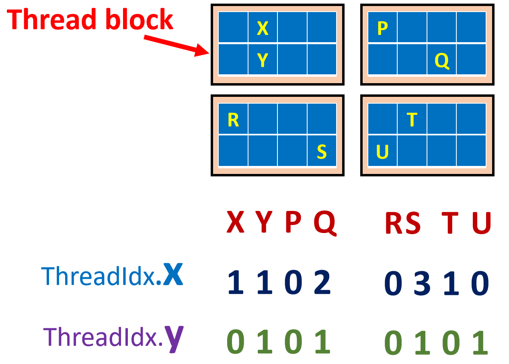
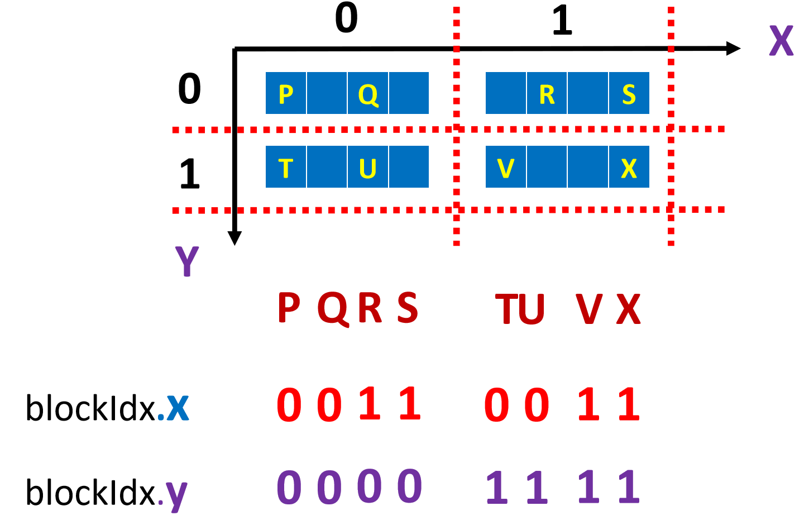
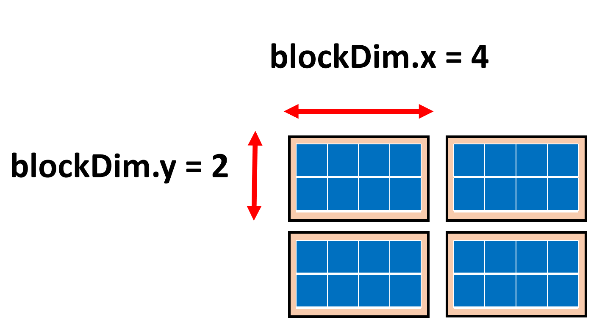
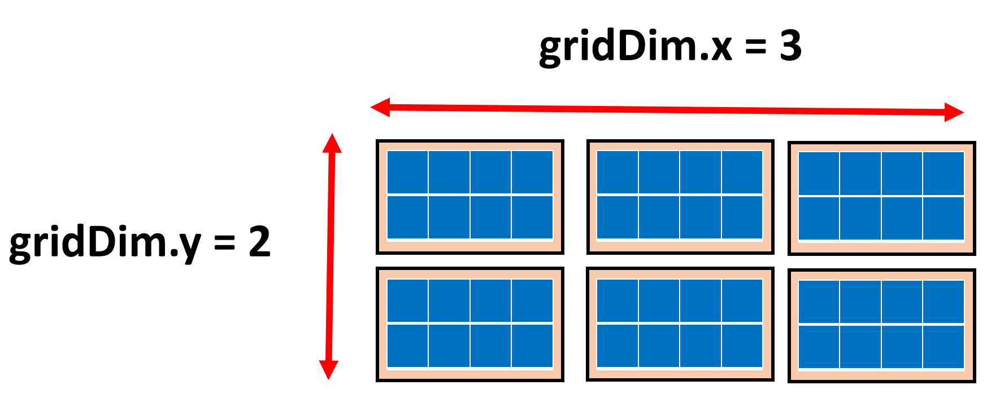

# hello_cuda

<p align="center">
    
</p>

```c++
dim3 grid(2, 2); // number of blocks
dim3 block(8, 2); // threads per block
hello_cuda << <grid, block>> > ();
```

threadIdx is dim3 type variable

<p align="center">
    
</p>

blockIdx is dim3 type variable

<p align="center">
    
</p>

blockDim variable consist number of threads.

<p align="center">
    
</p>

gridDim variable consist number of thread blocks in each dimension of a grid

<p align="center">
    
</p>

Copy data from host to device

```c++
int array_size = 8;
int array_byte_size = sizeof(int) * array_size;
int h_data[] = { 23, 9, 4, 53, 65, 12, 1, 33 };

int* d_data;
cudaMalloc((void**)&d_data, array_byte_size);
cudaMemcpy(d_data, h_data, array_byte_size, cudaMemcpyHostToDevice);
```