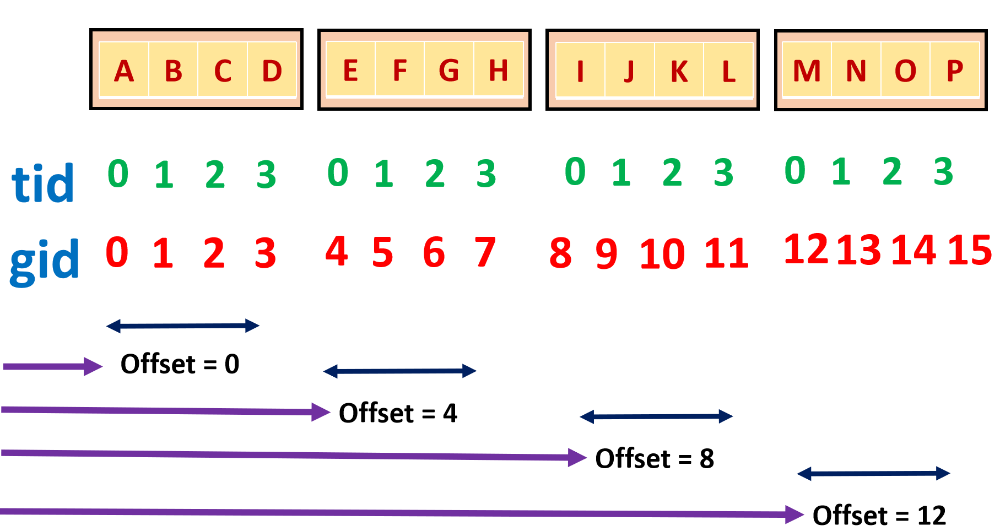
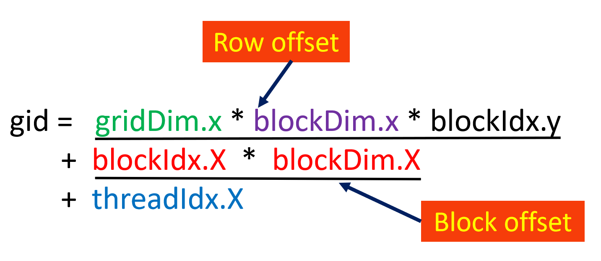
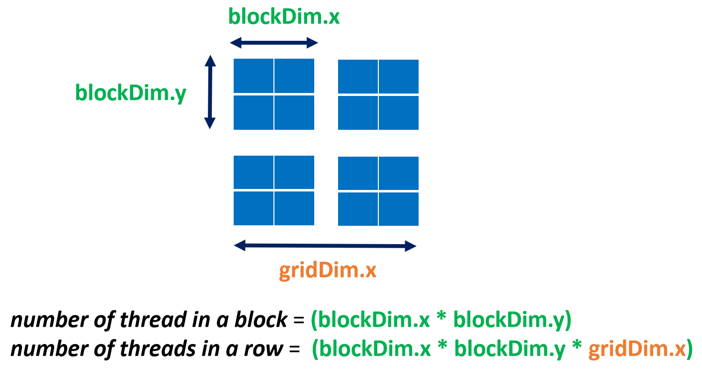
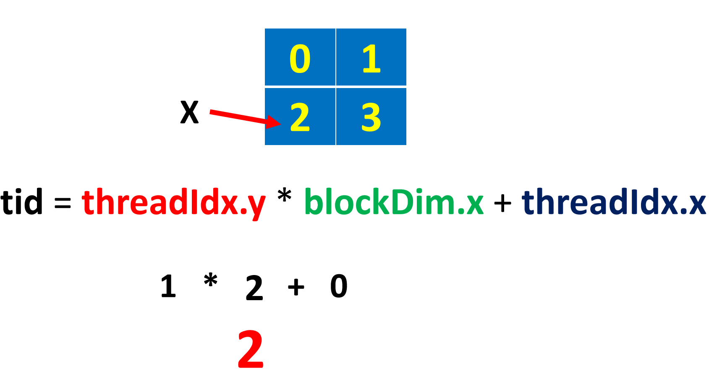

# hello_cuda

<p align="center">
    
</p>

```c++
dim3 grid(2, 2); // number of blocks
dim3 block(8, 2); // threads per block
hello_cuda << <grid, block>> > ();
```

threadIdx is dim3 type variable

<p align="center">
    
</p>

blockIdx is dim3 type variable

<p align="center">
    
</p>

blockDim variable consist number of threads.

<p align="center">
    
</p>

gridDim variable consist number of thread blocks in each dimension of a grid

<p align="center">
    
</p>

Copy data from host to device

```c++
int array_size = 8;
int array_byte_size = sizeof(int) * array_size;
int h_data[] = { 23, 9, 4, 53, 65, 12, 1, 33 };

int* d_data;
cudaMalloc((void**)&d_data, array_byte_size);
cudaMemcpy(d_data, h_data, array_byte_size, cudaMemcpyHostToDevice);
```

Calculate the unique index

<p align="center">
    
</p>

```c++
gid = tid + offset
grid = tid + blockIdx.x * blockDim.x
```

### Calculate 2D indexes

<p align="center">
    
</p>

```c++
int tid = threadIdx.x;
int block_offset = blockIdx.x * blockDim.x;
int row_offset = gridDim.x * blockDim.x * blockIdx.y;
int gid = row_offset + block_offset + tid;
```

### Calculate 2Dx2D indexes
<p align="center">
    
</p>

***Block offset***
```c++
int number_threads_in_a_block = blockDim.x * blockDim.y;
int block_offset = number_threads_in_a_block * blockIdx.x;
```

***Row offset***
```c++
int number_threads_in_a_row = number_threads_in_a_block * gridDim.x;
int row_offset = number_threads_in_a_row * blockIdx.y;
```

***Tid***
<p align="center">
    
</p>

```c++
int tid = threadIdx.y * blockDim.x + threadIdx.x;
int gid = row_offset + block_offset + tid;
```

### Calculate 3D indexes

```c++
int gid = blockDim.x * blockDim.y * threadIdx.z
    + blockDim.x * threadIdx.y
    + threadIdx.x
    ;
```

### Calculate 3Dx3D indexes

```c++
int number_threads_in_a_block = blockDim.x * blockDim.y * blockDim.z;
int number_threads_in_a_plan = number_threads_in_a_block * gridDim.x * gridDim.y;
int gid = number_threads_in_a_plan * blockIdx.z
    + number_threads_in_a_block * gridDim.x * blockIdx.y
    + number_threads_in_a_block * blockIdx.x
    + blockDim.x * blockDim.y * threadIdx.z
    + blockDim.x * threadIdx.y
    + threadIdx.x
    ;
```